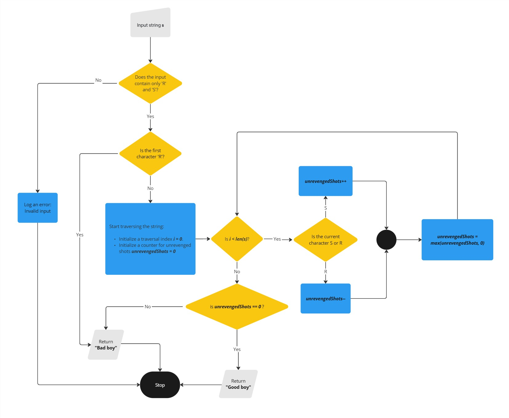

# Problem 1: Boss Baby's Revenge

## Description

Boss Baby, known for his cool and clever ways, deals with teasing from the neighborhood kids who shoot
water guns at his house. In response, Boss Baby seeks revenge by shooting at least one shot back, but only
if the kids have already shot at him first. As Boss Baby's assistant, your task is to check if Boss Baby has
sought revenge for every shot aimed at him at least once and hasn't initiated any shooting himself.

## Input

A string `S` (1 ≤ len(S) ≤ 1,000,000) containing characters `'S'` and `'R'`, where `'S'` represents a shot and `'R'`
represents revenge. The string represents the sequence of events for one day. containing:

## Output

Return **"Good boy"** if all shots have been revenged at least once and Boss Baby doesn’t initiate any shots at
the neighborhood kids first. Return **"Bad boy"** if these conditions are not satisfied.

## Note

- Boss Baby doesn’t need to shoot back before the next shots of the kids. He can shoot back whenever
  he wants as long as he doesn’t shoot first

## Examples

| Input      | Output   |
| ---------- | -------- |
| `SRSSRRR`  | Good boy |
| `RSSRR`    | Bad boy  |
| `SSSRRRRS` | Bad boy  |
| `SRRSSR`   | Bad boy  |
| `SSRSRR`   | Good boy |

---

# Solution Approach

The solution involves validating two conditions:

1. Boss Baby does not initiate a shot (`R`) before being shot at (`S`).
2. Every shot (`S`) has at least one corresponding revenge shot (`R`).

---

## Algorithm

1. **Validate Input**:
   - Ensure the input string contains only characters `'R'` and `'S'`.
2. **Check First Event**:
   - The first event must be `'S'` because Boss Baby cannot initiate a shot. If not, return **"Bad boy"** immediately.
3. **Initialize Counter**:
   - Create a counter for unrevenged shots (`unrevengedShots`).
4. **Traverse the String**:
   - For `'S'`: Increment the `unrevengedShots` counter.
   - For `'R'`: Decrement the `unrevengedShots` counter.
     - If `unrevengedShots < 0`, reset it to `0`. This means Boss Baby has already revenged all shots he received at least once.
5. **Final Check**:
   - If `unrevengedShots == 0`, return **"Good boy"** (all shots have been revenged at least once, and Boss Baby didn’t initiate any shots first).
   - Otherwise, return **"Bad boy"** (indicating there are remaining unrevenged shots).

See the flowchart below for a visual representation of this process.

## Flowchart

## 

## Complexity Analysis

- **Time Complexity**:

  The algorithm traverses the string once, making it O(n), where n is the length of the string.

- **Space Complexity**:

  O(n) because we need to allocate memory for the input string s, which has a length of n

  If we don't count the input string, the space complexity would be O(1) as we only use a constant amount of space for the unrevengedShots counter.

## How to Run Code

### Prerequisites

- Install [Go](https://go.dev/doc/install) on your system.

### Steps to Run the Code

1. **Run the Program**:  
   Use the following command in your terminal to run the program:

   ```bash
   go run solution.go
   ```

2. **Provide Input**:
   When prompted, input a string made up of 'R' and 'S'. For example:

   ```bash
   SRSSRRR
   ```

3. **Output**:
   The program will output one of the following messages:

   - "Good boy" if all shots have been revenged at least once and Boss Baby didn’t initiate any shots.
   - "Bad boy" if there are unrevenged shots or if Boss Baby initiated a shot.

   ```bash
   $ go run solution.go
   SRSSRRR
   Good boy
   ```

### Running Tests

1. **Test Cases**:
   The test cases are already written in the file solution_test.go. You can modify or add any other test cases to test various scenarios

2. **Run the Tests**:
   To run the tests, use the following command in your terminal:

   ```bash
   go test
   ```

   This will execute the test cases defined in solution_test.go and output the test results.

   **Example**:

   ```bash
   $ go test
   ok   band_protocol_assignment/problem_1	0.322s
   ```
