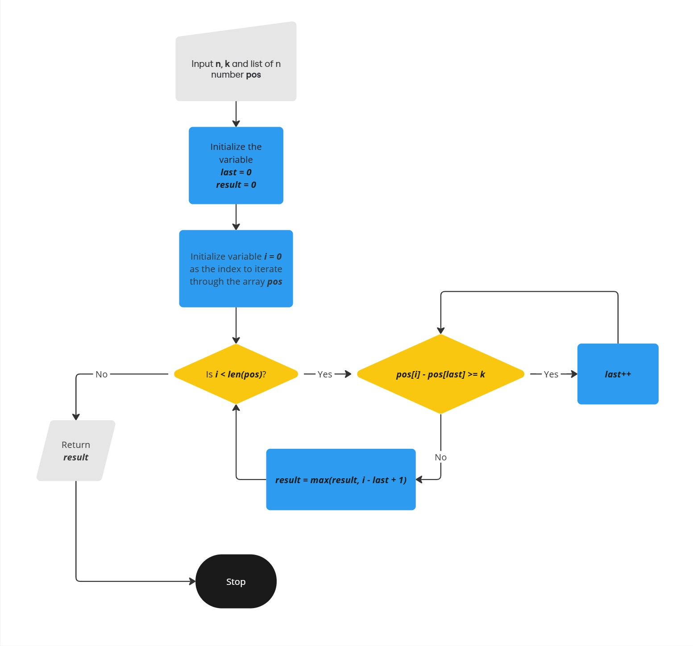

# Problem 2: Superman's Chicken Rescue

## Description

In a one-dimensional world, Superman needs to protect chickens from a heavy rainstorm using a roof of limited
length. Given the positions of chickens and the length of the roof Superman can carry, determine the maximum
number of chickens Superman can protect.

## Input

The input consists of two integers `n` and `k` (1 <= n,k <= 1,000,000), where `n` represents the number of chickens
and `k` denotes the length of the roof Superman can carry. The next line contains n integers (1 <= x <=
1,000,000,000) representing the positions of the chickens on the one-dimensional axis.

## Output

Output a single integer, denoting the maximum number of chickens Superman can protect with the given roof
length.

## Note

- Superman can position the roof starting at any point on the axis.
- The roof can cover chickens whose positions are within k units from its starting point.
- It's not required to cover all chickens, but to maximize the number of chickens protected.
- It’s guaranteed that the given positions of the chickens will be sorted from lowest to highest.

## Examples

| Input                        | Output |
| ---------------------------- | ------ |
| `5 5`<br>`2 5 10 12 15`      | 2      |
| `6 10`<br>`1 11 30 34 35 37` | 4      |

---

# Solution Approach

### Key Insights:

- The chickens are already sorted in ascending order of their positions.
- For any given position, the roof can cover chickens from the starting point up to, but not including, `k` units away.
- We need to find the largest contiguous subarray of chickens where the difference between the first and last chicken in that subarray is less than `k`.
- To find the maximum number of chickens that can be covered, it is sufficient to place the end of the roof at the rightmost chicken's position.

To solve this problem efficiently, we use a **sliding window** approach:

1. **Two pointers**: We maintain two pointers, `i` and `last`. The pointer `i` iterates over each rightmost chicken's position, while `last` tracks the farthest starting chicken's position that can still be covered by the roof ending at position `i`.
2. For each chicken at position `i`, we move the `last` pointer forward as long as the distance between the position of the chicken at `i` and the chicken at `last` is greater than or equal to `k`. This ensures that the roof covers as many chickens as possible within the length constraint.
3. For each valid range (range covered by the roof), calculate the number of chickens covered by `i - last + 1` (counting the chickens from the starting chicken at index last to the rightmost chicken at index i) and update the result with the maximum number.

By using two pointers, we avoid redundant checks and ensure that the solution runs efficiently even for large inputs.

## Algorithm

1. Initialize two variables:
   - `last = 0`: The pointer that tracks the starting chicken that can be covered by the roof.
   - `result = 0`: The variable that stores the maximum number of chickens that can be covered.
2. Loop through the chickens using pointer `i`:
   - For each chicken at position `pos[i]`, move the `last` pointer forward as long as `pos[i] - pos[last] >= k` (i.e., the roof can no longer cover the chickens from `last` to `i`).
3. For each valid position of `i` and `last`, calculate the number of chickens covered by the roof as `i - last + 1` and update `result` if this value is greater than the current `result`.

4. Return the value of `result` as the answer, which represents the maximum number of chickens that can be protected under the roof.

See the flowchart below for a visual representation of this process.

## Flowchart

## 

## Complexity Analysis

- **Time Complexity**:

  The time complexity of this algorithm is **O(n)** because both pointers, `i` and `last`, only move forward through the array of chicken positions once.

- **Space Complexity**:

  The space complexity is **O(n)** due to the input array storing the positions of the chickens.

## How to Run Code

### Prerequisites

- Install [Go](https://go.dev/doc/install) on your system.

### Steps to Run the Code

1. **Run the Program**:  
   Use the following command in your terminal to run the program:

   ```bash
   go run solution.go
   ```

2. **Provide Input**:
   When prompted, input the number of chickens n and the roof length k, followed by the positions of the chickens. For example:

   ```bash
   5 5
   2 5 10 12 15
   ```

3. **Output**:
   The program will output the maximum number of chickens that can be protected under the roof.

   ```bash
   $ go run solution.go
   2
   ```

### Running Tests

1. **Test Cases**:
   The test cases are already written in the file solution_test.go. You can modify or add any other test cases to test various scenarios

2. **Run the Tests**:
   To run the tests, use the following command in your terminal:

   ```bash
   go test
   ```

   This will execute the test cases defined in solution_test.go and output the test results.

   **Example**:

   ```bash
   $ go test
   ok   band_protocol_assignment/problem_2	0.418s
   ```
