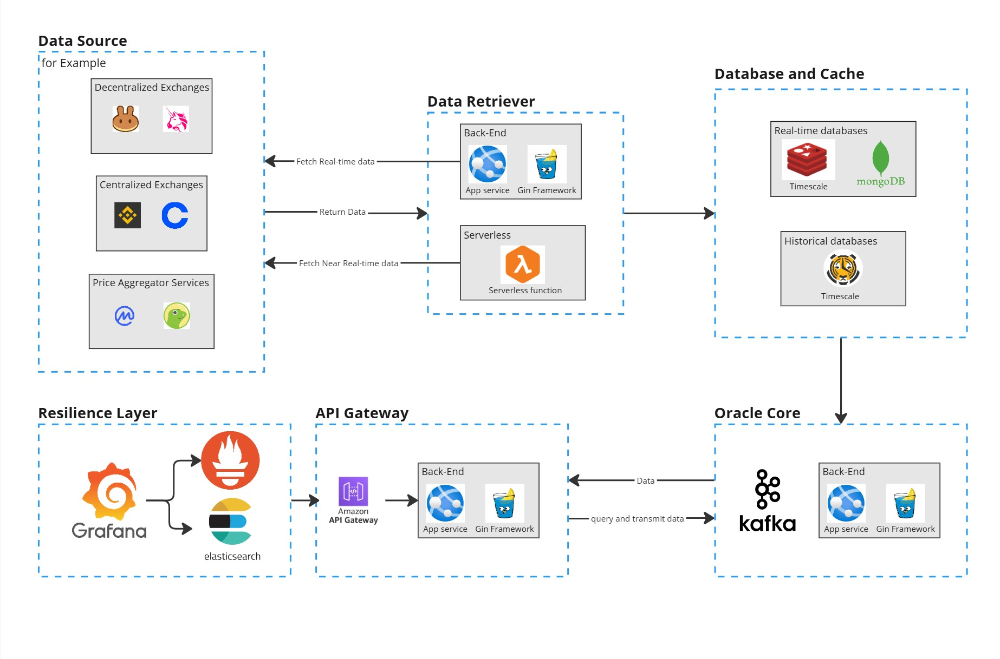
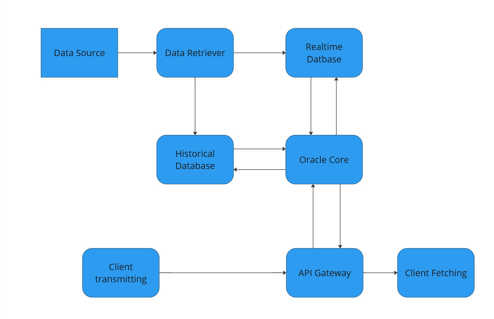

# Problem 3: Design Oracle System

## Background

As part of our ongoing initiatives, we are embarking on the development of a versatile oracle system. This oracle is intended to retrieve and transmit real-time cryptocurrency prices from various sources, including Decentralized Exchanges (e.g., Uniswap), Centralized Exchanges (e.g., Binance), and Price Aggregator Services (e.g., CoinMarketCap, CoinGecko). The system's architecture is designed to support multiple clients with diverse asset requirements, offering them the capability to seamlessly query and send cryptocurrency prices through this service.

## Task

Your task is to outline a comprehensive plan for the implementation of this flexible oracle system. The system should cater to the distinct needs of multiple clients, allowing them to interact with the oracle to fetch and transmit real-time cryptocurrency prices. While you are not expected to fully implement the solution, your plan should encompass the technical approach, architectural components, and interactions required to achieve this flexible oracle system.

## Instructions

- Provide a high-level overview of the proposed oracle system architecture. Describe how the system will interface with various sources to fetch cryptocurrency prices.

- Detail the mechanism by which clients can query the oracle to retrieve real-time cryptocurrency prices. Highlight the steps involved and the data format that clients can expect.

- Explain how the oracle system will accommodate clients' needs for transmitting cryptocurrency prices. Describe the process by which clients can submit price data through the oracle.

- Discuss the potential challenges and considerations in maintaining data accuracy and consistency across different sources and clients.

- Outline the error handling and resilience strategies that will ensure the robustness of the oracle system, especially in scenarios where specific data sources are unavailable.

- Since clear documentation is essential, briefly explain how you would document your oracle solution for both internal engineering teams and the client.

## Resources

For a visual representation of the proposed oracle system architecture

## 

## 

For detailed information about the design, including technical approach, architectural components, and interactions, please read the PDF file
[oracle_system_design.pdf](./oracle_system_design.pdf).
